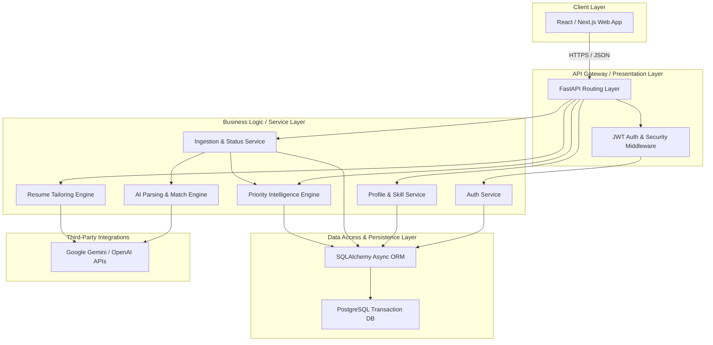
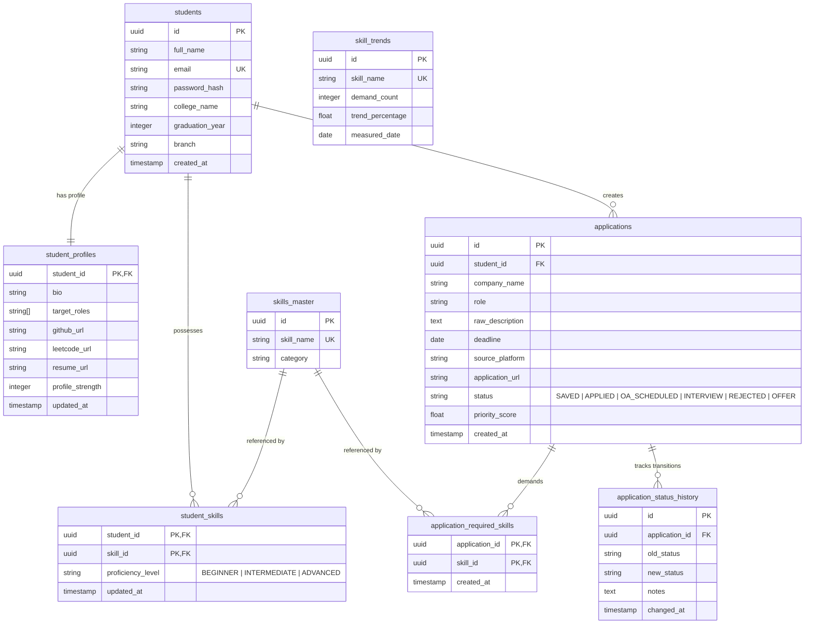

# Rythm — AI-Powered Student Career Workflow Intelligence Platform

Rythm is a state-driven career workflow orchestration system designed to support students throughout their career preparation and opportunity tracking. Rather than acting as a simple spreadsheet or CRUD job tracker, Rythm operates as a continuously evolving intelligence graph. Every action a student takes generates structured state, skill gap analytics, priority recommendations, and adaptive resume tailoring suggestions.

---

## 🚀 Key Features

* **Student Registration & Secure Identity**: Hashed passwords using `bcrypt` and JWT session tracking, with UUID protection against enumeration attacks.
* **Unified Career Profile**: Centralized, queryable skills catalog (`skills_master`) mapping profile strength, target roles, and performance links (LeetCode, GitHub).
* **Frictionless Ingestion (No unstable scrapers)**: Copy-paste job descriptions and details from LinkedIn, Naukri, AICTE, etc. for local storage.
* **AI Parsing & Semantic Extraction**: Auto-extracts required skills, experience levels, and domains from raw description texts.
* **Skill Match & Gap Analysis Engine**: Compares candidate skills against job requirements to calculate matching metrics and identify specific areas of development.
* **Priority Intelligence Engine**: Mathematically ranks opportunities by urgency, skill alignment, market trends, and candidate preference using a normalized weighted formula.
* **Resume Tailoring Engine**: Context-engineered LLM recommendations suggesting additions/removals to maximize relevance for target roles.
* **Status History Tracking**: Comprehensive audit trail of application stages (`Saved`, `Applied`, `OA Scheduled`, `Interview`, `Rejected`, `Offer`) to compute funnel metrics.
* **Adaptive Trend Intelligence**: Continually scrapes system-wide ingestion trends to show what skills (e.g., Redis, Kafka, Spring Boot) are currently seeing hiring surges.

---

## 🛠️ Technology Stack

* **Backend**: Python 3.12+ (FastAPI, Async SQLAlchemy, Pydantic validations)
* **Database**: PostgreSQL 16 (Relational tables with joint indexes and UUIDs)
* **Cache**: Redis 7 (TTL-aware caching layer)
* **Security**: PyJWT, Passlib (with bcrypt), GZip compression, custom sliding window rate limiter
* **Containerization**: Docker & Docker Compose

---

## 📂 Repository Structure

* [docs/proposal.md](file:///D:/rythm/docs/proposal.md) — Platform proposal and business/technical workflow detail.
* [docs/proposal.docx](file:///D:/rythm/docs/proposal.docx) — Compiled Microsoft Word version of the proposal for review.
* [docs/architecture.md](file:///D:/rythm/docs/architecture.md) — Layered backend system architecture & Mermaid flow diagrams.
* [docs/database_erd.md](file:///D:/rythm/docs/database_erd.md) — Schema definitions and Entity-Relationship diagram.
* [docs/api_specification.md](file:///D:/rythm/docs/api_specification.md) — Complete REST API endpoint reference.
* [docs/roles_responsibilities.md](file:///D:/rythm/docs/roles_responsibilities.md) — Team organization, roles, and RACI matrix.
* [docs/project_board.md](file:///D:/rythm/docs/project_board.md) — Interactive task list and development milestones.
* [docs/setup_guide.md](file:///D:/rythm/docs/setup_guide.md) — Local development and environment setup instructions.
* [docs/deployment_guide.md](file:///D:/rythm/docs/deployment_guide.md) — Production checklist, security policies, and architectural limits.
* [docs/presentation.md](file:///D:/rythm/docs/presentation.md) — 20-slide Marp project showcase presentation.
* [backend/](file:///D:/rythm/backend/) — Backend source folder (FastAPI router packages, database models, schemas, and seeder).

---

## 📋 Full Project Plan & Approach

### 1. Problem Statement
The entry-level job search process for engineering and technical students is highly fragmented and passive. Students face:
1. **Spreadsheet Fatigue**: Tracking applications across multiple job boards (LinkedIn, Naukri, AICTE) manually without automated follow-ups leads to missed deadlines.
2. **Resume ATS Rejection**: Standard, generic resumes fail applicant tracking systems (ATS) because they lack specific keyword alignment.
3. **Prioritization Paralysis**: No quantitative metric defines which job requires immediate attention based on deadlines, match level, or trends.
4. **Outdated Focus**: Students are unaware of shifting market demands (e.g., surges in Redis or Kafka hiring requirements).

### 2. Solution Approach
Rythm introduces a state-driven career workflow intelligence system. It utilizes:
* **LLM Ingestion & Semantic Extraction**: Converts raw job description copy-pastes into structured, queryable required skills catalogs without scraping instability.
* **Normalized Relational Schema**: Stores profiles, master skill catalogs, and tracking pipelines in structured PostgreSQL tables with cascading constraints.
* **Linear-Decay Priority Engine**: Evaluates applications mathematically using a normalized weighted equation overlaying deadline urgency, skill fit, market trends, and student interest.
* **Resume Context Engineering**: Direct context comparison between student profiles and parsed requirements to generate delta revisions.
* **Cohort Trend Analysis**: Aggregates skills demanded across all user applications to track localized hiring trends (e.g. "Spring Boot demand is up 18%").

---

## 📐 System Architecture Diagram



---

## 🗄️ Relational Database ERD & Verified Schema



### Verified Schema Tables
The database schema has been verified inside the running `rythm-postgres` docker container. The following 8 tables are present:
1. `students` — Credentials, emails, names, roles, reset tokens.
2. `student_profiles` — Bios, portfolios, targets, strength.
3. `skills_master` — central directory of tech tags.
4. `student_skills` — junction user proficiencies.
5. `applications` — opportunity tracking with priority scores and status values.
6. `application_required_skills` — AI-extracted requirements.
7. `application_status_history` — conversion audits.
8. `skill_trends` — cache-backed weekly growth counts.

---

## 🔌 API Endpoints Specification Summary

All endpoints are prefixed with `/api/v1`.

### 1. Authentication & Security
* `POST /auth/register` — Registers a new user, hashes password via bcrypt, establishes skeleton profile, returns JWT and refresh token.
* `POST /auth/login` — Verifies student login and returns access token.
* `POST /auth/password-reset-request` — Registers reset token and simulates background email transmission via FastAPI `BackgroundTasks`.
* `POST /auth/password-reset-confirm` — Confirms reset token and updates password hash.

### 2. User Profiles & Skills
* `POST /profile/initialize` — Configures target roles, bio, and social portfolio URLs. Updates profile strength score.
* `GET /profile` — Retrieves the student's primary profile and metrics.
* `POST /profile/skills` — Maps list of student skills with BEGINNER, INTERMEDIATE, or ADVANCED levels from/to the central skills master catalog.
* `GET /profile/skills` — Returns student's active skills.

### 3. Application Ingestion & Tracking
* `POST /applications/ingest` — Primary text ingestion. Triggers LLM skill extraction, maps skill gaps, computes urgency/preference, and returns calculated priority score.
* `GET /applications` — Lists all tracking opportunities sorted by priority score (descending). Supports `search` keywords, `status` filter, and `skip`/`limit` pagination bounds.
* `PATCH /applications/{id}/status` — Transitions the state (e.g. `SAVED` -> `OA_SCHEDULED` -> `INTERVIEW`), updating priority scores and logging the change to history audits.

### 4. Career Intelligence
* `POST /applications/{id}/resume-tailor` — Compares raw resume text with opportunity requirement. Returns target keyword gaps, bullet optimizations, and highlights.
* `GET /analytics/overview` — Compares funnel conversion metrics (interview rate, offer conversion) and lists missing skills.
* `GET /analytics/market-trends` — Identifies macro demand shifts inside the database cohort (hot skills, demand growth weekly indices). Uses cache-first queries via Redis.

---

## 🐳 Docker Deployment & Verification

To run and verify the containerized services locally:

### 1. Start the Stack (PostgreSQL, Redis, and FastAPI)
Ensure Docker Desktop is running, then run:
```bash
docker compose up --build -d
```

### 2. Seed the Database
Run the seeding script inside the running API container to populate master data:
```bash
docker exec rythm-api python backend/seed.py
```

### 3. Run Integration Tests
Trigger the automated test client to verify auth flow, ingestion, caching, and rate limiting:
```bash
docker exec rythm-api python backend/tests/run_api_tests.py
```

### 4. Run REST Client Test Suite
You can also run requests manually using VS Code's **REST Client** extension by opening [backend/tests/api_tests.http](file:///D:/rythm/backend/tests/api_tests.http) and selecting `Send Request` above any HTTP endpoint block.

---

## 🛡️ License

This project is proprietary and confidential. Developed under the codename **Rythm**.
