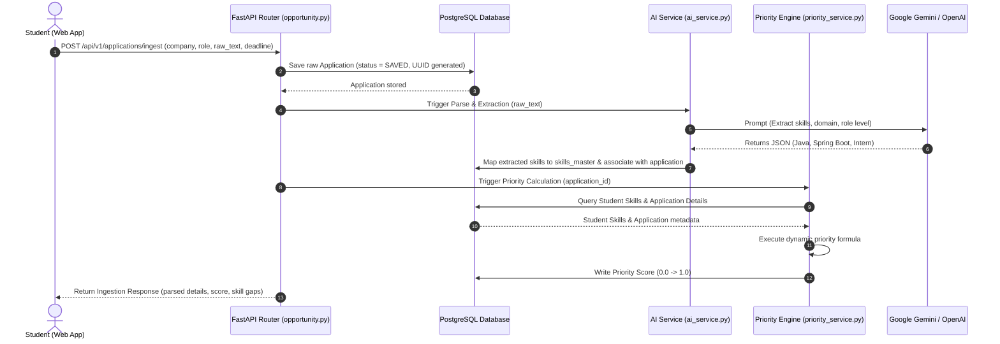
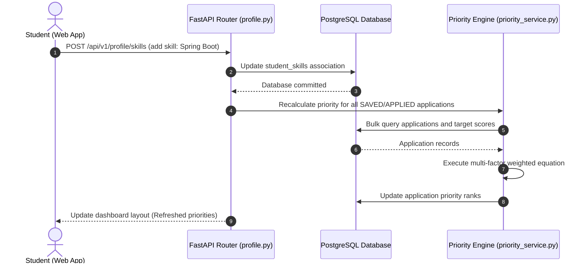

# System Architecture: Rythm

## Clean, Layered Backend Architecture

Rythm is designed using a **Clean, Layered Architecture** to decouple our business logic, database infrastructure, and Large Language Model (LLM) providers. This ensures maintainability, easier testing, and the flexibility to swap database models or LLM providers without major service disruptions.

---

## 1. Architectural Blueprint

```mermaid
graph TD
    subgraph Client Layer
        Web[React / Next.js Web App]
    </style>
    end

    subgraph API Gateway / Presentation Layer
        Router[FastAPI Routing Layer]
        AuthGuard[JWT Auth & Security Middleware]
    end

    subgraph Business Logic / Service Layer
        AuthServ[Auth Service]
        ProfServ[Profile & Skill Service]
        IngestServ[Ingestion & Status Service]
        AIServ[AI Parsing & Match Engine]
        PriorServ[Priority Intelligence Engine]
        ResumeServ[Resume Tailoring Engine]
    end

    subgraph Data Access & Persistence Layer
        DB[PostgreSQL Transaction DB]
        SQLA[SQLAlchemy Async ORM]
    end

    subgraph Third-Party integrations
        LLM[Google Gemini / OpenAI APIs]
    end

    Web -->|HTTPS / JSON| Router
    Router --> AuthGuard
    AuthGuard --> AuthServ
    
    %% Services connections
    Router --> IngestServ
    Router --> ProfServ
    Router --> PriorServ
    Router --> ResumeServ

    IngestServ --> AIServ
    IngestServ --> PriorServ
    AIServ --> LLM
    ResumeServ --> LLM

    AuthServ --> SQLA
    ProfServ --> SQLA
    IngestServ --> SQLA
    PriorServ --> SQLA
    
    SQLA --> DB
```

---

## 2. Layer Descriptions

### 1. Presentation / Route Layer (`app/routers/`)
* **Technology**: FastAPI Routers
* **Role**: Defines the RESTful HTTP API specifications, coordinates security scopes, parses incoming JSON schemas via Pydantic, and handles HTTP response codes.
* **Characteristics**: Zero database queries or direct AI requests. This layer solely validates inputs, passes them to service functions, and maps output models.

### 2. Business Logic / Service Layer (`app/services/`)
* **Role**: The heart of the platform. Executes functional logic, calculations, and external integrations.
* **Services**:
  * **AI Service**: Orchestrates prompt engineering templates and structured JSON responses from LLM endpoints.
  * **Priority Engine**: Evaluates application attributes and computes the prioritized score via the normalized weighted formula.
  * **Resume Service**: Packages current skills and jobs into custom system prompts to return delta suggestions.
  * **Profile / Status Service**: Evaluates workflow states and records auditing history.

### 3. Data Access / Persistence Layer (`app/database.py`, `app/models/`)
* **Technology**: SQLAlchemy 2.0 Async Engine + PostgreSQL
* **Role**: Maps objects to relational tables. Performs structured CRUD, updates status records, and fetches trend aggregates.

---

## 3. Core System Data Flows

### A. Opportunity Ingestion & AI Skill Extraction
This sequence diagram shows the interaction when a student pastes a raw job description. The backend stores the job, requests skill extraction, performs gap comparisons, and recalculates prioritizations asynchronously.



### B. Dynamic Priority Indexing
Whenever a student updates their skills, adds new opportunities, or approach deadlines, the system re-calculates the priority score to keep the dashboard organized.



---

## 4. Key Architectural Design Choices

1. **Paste Ingestion over Automated Scrapers**: As detailed in our proposal, avoiding external site scrapers shields our backend from platform rate-limiting, login blockades, and anti-bot protection changes. It guarantees $100\%$ availability.
2. **Normalized Skills Catalog**: Rather than keeping skills inside loose text arrays in the database, the `skills_master` catalog provides a clean taxonomy. This makes it simple to compute intersections and generate macro trend metrics across the platform.
3. **Decoupled AI Core**: The LLM interaction is abstract. The `ai_service.py` handles communication, allowing the platform to swap between OpenAI GPT-4o, Google Gemini Pro, or local open-source models with minimal code changes.
