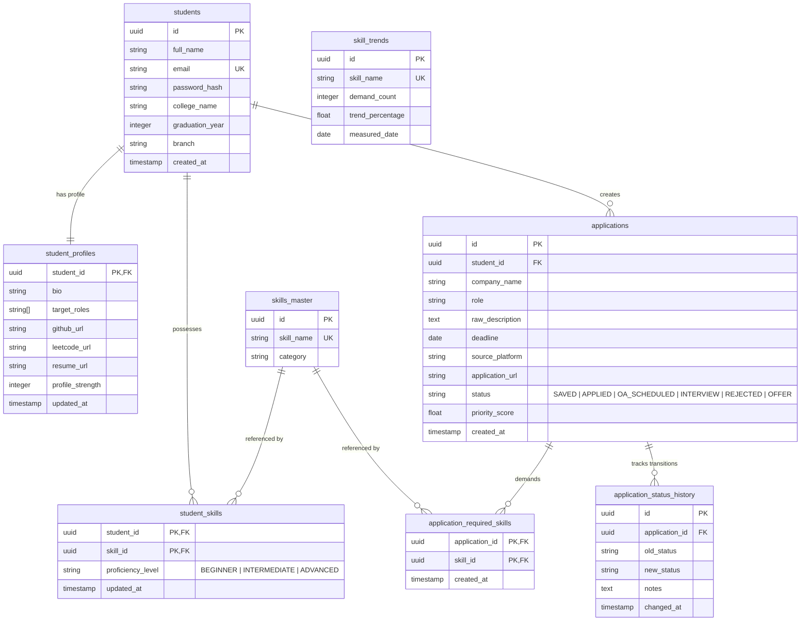

# Database Schema & ERD: Rythm

This document outlines the PostgreSQL database structure for Rythm, detailing the relationships, tables, data types, and performance indexing strategies designed to handle state-driven career workflow orchestration.

---

## 1. Database Architecture Principles

* **Relational Integrity**: We use PostgreSQL to enforce relational constraints (e.g. foreign keys with cascade deletions, unique indices, and check constraints) to ensure that applicant profiles, tracking states, and skills catalog mappings remain synchronized.
* **UUID Primary Keys (UUIDv4)**: Instead of auto-incrementing integers (`1`, `2`, `3`), we utilize 128-bit UUIDs for all primary keys.
  * **Security**: Prevents ID enumeration attacks where malicious actors can scrape profiles by guessing successive integers (`/api/v1/students/12`).
  * **Scalability**: Enables safe offline ID generation and simplifies multi-master replication in later scaling phases.
* **Indexed Joins**: Core tables like `student_skills` and `application_required_skills` operate as junction tables with primary key pairs, optimized for relational intersection operations.

---

## 2. Entity-Relationship Diagram (ERD)

---

## 3. Detailed Data Dictionary

### Table: `students`
Stores base authentication credentials and college attributes.

| Column | Type | Constraints | Description |
| :--- | :--- | :--- | :--- |
| `id` | `UUID` | Primary Key, Default: gen_random_uuid() | Unique identifier for the student. |
| `full_name` | `VARCHAR(150)` | Not Null | Student's full name. |
| `email` | `VARCHAR(255)` | Unique, Not Null | Email address (used as login username). |
| `password_hash` | `VARCHAR(255)` | Not Null | Bcrypt hash of user password. |
| `college_name` | `VARCHAR(150)` | Not Null | University/College name. |
| `graduation_year`| `INTEGER` | Not Null | Expected graduation year (e.g. 2027). |
| `branch` | `VARCHAR(100)` | Not Null | Branch of study (e.g., CSE, ECE). |
| `created_at` | `TIMESTAMP` | Default: CURRENT_TIMESTAMP | Account creation time. |

### Table: `student_profiles`
Maintains supplemental student details and target career profiles.

| Column | Type | Constraints | Description |
| :--- | :--- | :--- | :--- |
| `student_id` | `UUID` | Primary Key, Foreign Key (students.id ON DELETE CASCADE) | Back-reference link to `students`. |
| `bio` | `TEXT` | Nullable | Short summary bio. |
| `target_roles` | `VARCHAR(100)[]` | Not Null | Array of desired job titles. |
| `github_url` | `VARCHAR(255)` | Nullable | Link to GitHub profile. |
| `leetcode_url` | `VARCHAR(255)` | Nullable | Link to LeetCode profile. |
| `resume_url` | `VARCHAR(255)` | Nullable | Link to hosted PDF resume. |
| `profile_strength`| `INTEGER` | Default: 0 | Calculated completion percentage. |
| `updated_at` | `TIMESTAMP` | Default: CURRENT_TIMESTAMP | Profile modification timestamp. |

### Table: `skills_master`
Central directory of all recognized skills.

| Column | Type | Constraints | Description |
| :--- | :--- | :--- | :--- |
| `id` | `UUID` | Primary Key, Default: gen_random_uuid() | Unique identifier for the skill. |
| `skill_name` | `VARCHAR(100)` | Unique, Not Null | Name of skill (e.g. "Spring Boot"). |
| `category` | `VARCHAR(50)` | Not Null | Skill classification (e.g. "Language", "Framework"). |

### Table: `student_skills`
Junction table mapping student proficiencies.

| Column | Type | Constraints | Description |
| :--- | :--- | :--- | :--- |
| `student_id` | `UUID` | Composite PK, FK (students.id ON DELETE CASCADE) | Student foreign key. |
| `skill_id` | `UUID` | Composite PK, FK (skills_master.id ON DELETE CASCADE) | Master skill foreign key. |
| `proficiency_level`| `VARCHAR(20)` | Default: 'BEGINNER' | Level: 'BEGINNER', 'INTERMEDIATE', 'ADVANCED'. |
| `updated_at` | `TIMESTAMP` | Default: CURRENT_TIMESTAMP | Modification timestamp. |

### Table: `applications`
Core tracking database of internships and opportunities.

| Column | Type | Constraints | Description |
| :--- | :--- | :--- | :--- |
| `id` | `UUID` | Primary Key, Default: gen_random_uuid() | Application ID. |
| `student_id` | `UUID` | Foreign Key (students.id ON DELETE CASCADE), Not Null | Association to student. |
| `company_name` | `VARCHAR(100)` | Not Null | Hiring company (e.g., "Amazon"). |
| `role` | `VARCHAR(100)` | Not Null | Position role (e.g., "Backend Intern"). |
| `raw_description` | `TEXT` | Not Null | Copied job description. |
| `deadline` | `DATE` | Not Null | Application deadline. |
| `source_platform` | `VARCHAR(50)` | Not Null | Board source (e.g. "LinkedIn"). |
| `application_url` | `VARCHAR(255)` | Nullable | Hyperlink to apply. |
| `status` | `VARCHAR(30)` | Default: 'SAVED' | Tracking state of application. |
| `priority_score` | `FLOAT` | Default: 0.0 | Calculated ranking (0.0 to 1.0). |
| `created_at` | `TIMESTAMP` | Default: CURRENT_TIMESTAMP | Ingestion timestamp. |

### Table: `application_required_skills`
Junction table mapping AI-extracted required skills for an opportunity.

| Column | Type | Constraints | Description |
| :--- | :--- | :--- | :--- |
| `application_id` | `UUID` | Composite PK, FK (applications.id ON DELETE CASCADE) | Associated application. |
| `skill_id` | `UUID` | Composite PK, FK (skills_master.id ON DELETE CASCADE) | Associated skill required. |
| `created_at` | `TIMESTAMP` | Default: CURRENT_TIMESTAMP | Mapping creation timestamp. |

### Table: `application_status_history`
Tracks the chronological state changes for conversion funnels.

| Column | Type | Constraints | Description |
| :--- | :--- | :--- | :--- |
| `id` | `UUID` | Primary Key, Default: gen_random_uuid() | Audit log ID. |
| `application_id` | `UUID` | Foreign Key (applications.id ON DELETE CASCADE), Not Null | Associated application. |
| `old_status` | `VARCHAR(30)` | Not Null | Pre-transition status. |
| `new_status` | `VARCHAR(30)` | Not Null | Post-transition status. |
| `notes` | `TEXT` | Nullable | Optional student notes (e.g., "Cleared OA"). |
| `changed_at` | `TIMESTAMP` | Default: CURRENT_TIMESTAMP | Timestamp of state transition. |

### Table: `skill_trends`
Stores consolidated analytics on hot skills.

| Column | Type | Constraints | Description |
| :--- | :--- | :--- | :--- |
| `id` | `UUID` | Primary Key, Default: gen_random_uuid() | Record ID. |
| `skill_name` | `VARCHAR(100)` | Unique, Not Null | Skill matching trend. |
| `demand_count` | `INTEGER` | Not Null | Occurrence count in active postings. |
| `trend_percentage`| `FLOAT` | Not Null | Weekly rate of growth. |
| `measured_date` | `DATE` | Default: CURRENT_DATE | Logging date. |

---

## 4. Performance Indexing Strategies

To ensure sub-second response times on dashboards and analytical queries, we establish the following indexes in PostgreSQL:

1. **`idx_students_email`**: Unique B-Tree index on `students(email)`. Crucial for authentication lookups.
2. **`idx_applications_student_status`**: Composite index on `applications(student_id, status)`. Speeds up student pipeline dashboards.
3. **`idx_applications_priority`**: Descending B-Tree index on `applications(priority_score DESC)`. Speeds up priority ranking lookups.
4. **`idx_student_skills_lookup`**: Index on `student_skills(student_id, skill_id)`. Optimizes intersection matching queries.
5. **`idx_app_required_skills_lookup`**: Index on `application_required_skills(application_id, skill_id)`. Speeds up required skills checks.
