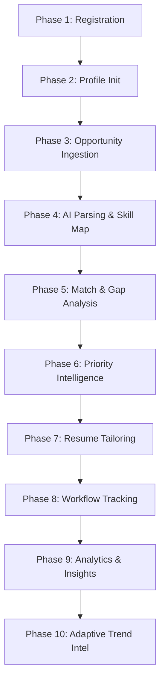

# Project Proposal: Rythm

## AI-Powered Student Career Workflow Intelligence Platform

---

## 1. Executive Summary

In today's highly competitive job market, engineering and technical students face an overwhelming and fragmented career search environment. Students manage applications across multiple portals (LinkedIn, Naukri, AICTE, Internshala, and university training & placement channels), track milestones in disjointed spreadsheets, and manually tailor resumes without clear, context-aware direction.

**Rythm** is a state-driven career workflow orchestration system that addresses this fragmentation. It consolidates scattered resources, analyzes candidate profiles, automates semantic job parsing, performs real-time skill gap analysis, and intelligently prioritizes opportunities using a weighted mathematical algorithm. 

Unlike traditional CRUD-based job trackers, Rythm builds a continuously evolving intelligence graph. Each user interaction—from updating a skill to pasting a job description—triggers state transitions, recalibrates priority scores, and refines tailoring recommendations.

---

## 2. Problem Statement & Tech Opportunity

### Traditional System Failures
1. **Spreadsheet Fatigue**: Students lose track of critical application steps (OA deadlines, interview schedules) because tracking is passive.
2. **Generic Resume Tailoring**: General resumes fail to pass Automated Applicant Tracking Systems (ATS) due to a lack of keyword alignment.
3. **Information Overload**: Students cannot easily identify which opportunities match their skills best, or which ones they should prioritize based on proximity to deadlines.
4. **Static Skill Assessment**: Students are unaware of the exact skills required by current market trends, causing them to focus on outdated tools.

### The Rythm Opportunity
Rythm changes the paradigm. By leveraging a normalized database schema alongside structured LLM semantic parsing, it bridges the gap between candidate readiness and market demand. Instead of attempting brittle web scraping of restricted job boards, Rythm implements a clean, paste-based ingestion system that utilizes Large Language Models (LLMs) to extract key parameters, maps them to a central skills catalog, and outputs immediate, actionable feedback to the student.

---

## 3. Core Workflow Architecture (Phases 1 — 10)

### Phase 1: Student Registration & Secure Identity
* **Action**: Registration requires validation of name, email, college, graduation year, branch, and credentials.
* **Security Principle**: Passwords undergo `bcrypt` hashing on the backend before being written to PostgreSQL. UUIDs are used for all public/private identification bounds to prevent ID enumeration attacks (`/student/1`, `/student/2`).
* **Output**: Backend returns a secure session package containing a JWT access token, a secure HTTP-only refresh token, and initial identity profiles.

### Phase 2: Unified Career Profile Initialization
* **Action**: Onboarding where students establish their target roles, current skill levels, and repository/platform handles (GitHub, LeetCode, Resume URLs).
* **Database Normalization**: Rather than storing student profiles as unstructured JSON, skills are stored in a normalized `student_skills` mapping table referring to a centralized `skills_master` catalog. This enables global analytics, skill comparisons, and trend tracking.
* **Output**: Dashboard initializes with a computed profile strength metric (e.g., 42%).

### Phase 3: Opportunity Ingestion (Core Tracking)
* **Action**: Copy-pasting raw job description text, title, company, URL, and deadlines from external sites.
* **Architecture Choice**: Employs user-driven pasting rather than active site-scraping. This avoids fragile infrastructure dependencies, API restrictions, anti-bot mechanisms, and authentication blockages of LinkedIn, Naukri, or AICTE.

### Phase 4: AI Parsing & Semantic Extraction Engine
* **Action**: The raw description is parsed by an LLM via context-engineered prompts.
* **Parsing Target**: The LLM extracts technical skills, required frameworks, domain categories, and experience level, returning structured JSON.
* **Database Mapping**: The backend maps the extracted text strings (e.g., "Spring Boot") to existing entries in `skills_master`. New skills are added to the mapping database.

### Phase 5: Skill Match & Gap Analysis Engine
* **Action**: System computes the intersection of student skills and required opportunity skills:
  $$\text{Match Score} = \frac{|\text{Student Skills} \cap \text{Required Skills}|}{|\text{Required Skills}|}$$
* **Output**: Renders a normalized matching percentage and lists exact missing skills (e.g., missing "Docker", "REST APIs"), giving the student an immediate blueprint for study.

### Phase 6: Priority Intelligence Engine
* **Action**: Opportunities are automatically ranked using a dynamic weighted prioritization algorithm:
  $$\text{Priority} = (w_1 \times \text{Urgency}) + (w_2 \times \text{Skill Match}) + (w_3 \times \text{Trend Relevance}) + (w_4 \times \text{Interest})$$
* **Purpose**: Surfaces the most urgent and suitable opportunities to the top of the student's dashboard.

### Phase 7: Resume Tailoring Engine
* **Action**: Structured context engineering (combining the student's current profile, raw resume text, and the parsed job description) is sent to the LLM.
* **Output**: Returns specific keywords to add, bullet points to optimize, and structural recommendations. The student retains full control to accept, reject, or regenerate suggestions.

### Phase 8: Application Workflow Tracking
* **Action**: Standard state machine transitions. The application moves from `Saved` $\rightarrow$ `Applied` $\rightarrow$ `OA Scheduled` $\rightarrow$ `Interview` $\rightarrow$ `Rejected` or `Offer`.
* **State Auditing**: Every status change is logged in `application_status_history` to track duration, bottlenecks, and conversions.

### Phase 9: Analytics & Intelligence Layer
* **Action**: Aggregate analytics calculated on the student's history, showing interview rates, application velocity, and a primary list of missing skills.

### Phase 10: Adaptive Trend Intelligence (UVP)
* **Action**: Platform aggregates required skills across *all* ingested opportunities in the system.
* **Unique Value**: Identifies macro shifts in hiring requirements (e.g., "Kafka demand up 32% this month"). This allows the platform to act as a career intelligence layer, advising the student on which technologies to learn next based on actual, localized market trends.

---

## 4. Business & Educational Value

1. **Structured Career Development**: Shifts students from guessing what to learn to systematically tackling identified skill gaps.
2. **Optimized Interview Rates**: Tailored resumes increase ATS pass rates and lead to higher interview conversion ratios.
3. **Actionable University Analytics**: Aggregated, anonymized student dashboard analytics can help universities identify curricula alignment gaps based on actual market demand.
